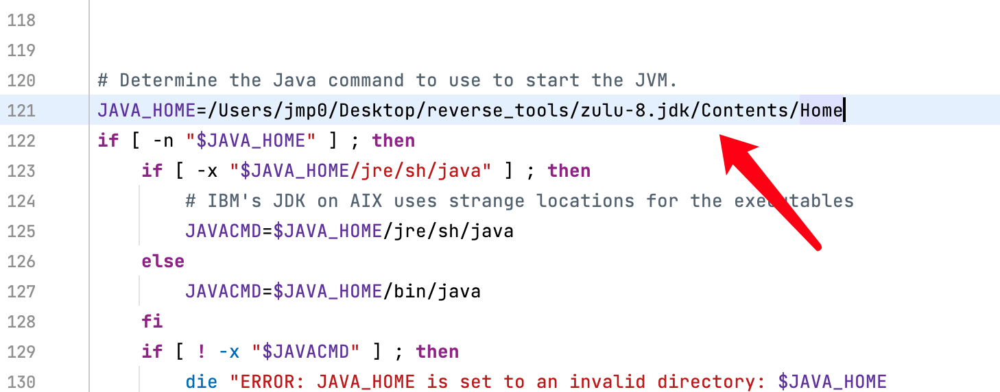
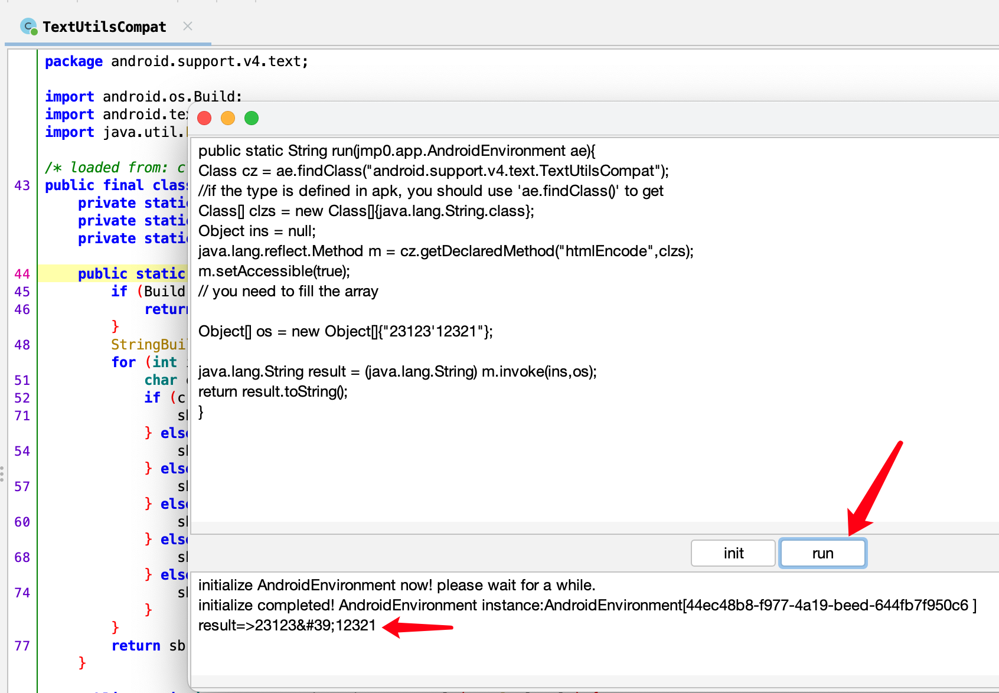

## AndroidRunnableJADX
### based on [jadx](https://github.com/skylot/jadx), commit id 540c0a81000ad7bca5e3c5a3409f230be76e9718
### powered by [appdbg](https://github.com/asmjmp0/appdbg)
	download url: https://pan.baidu.com/s/1ByWAzRRqu88cHXXebwMrOg 提取码: h8wd

1. use the JDK from [appdbg-JDK](https://github.com/asmjmp0/appdbg-JDK).
2. set JAVA_HOME in **jadx-gui** or **jadx-gui.bat**
3. click R key,or click right mouse button on a method node.
4. click init button.
5. click run button.
---------------------------------------
*Licensed under the Apache 2.0 License*
